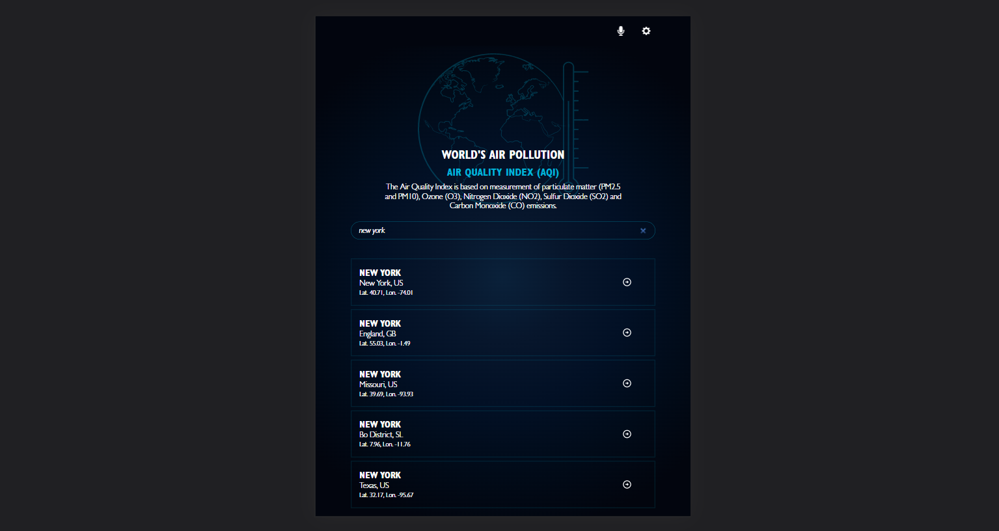
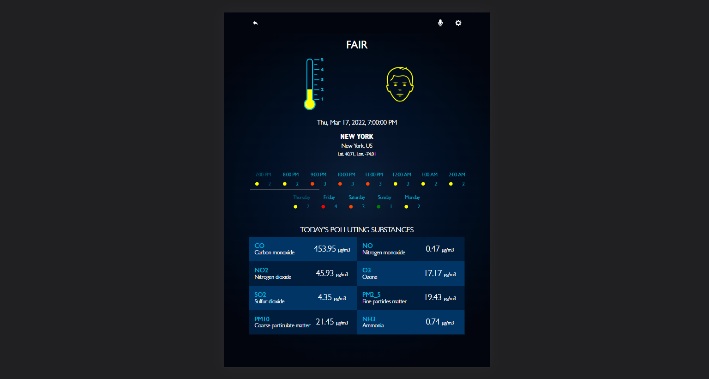

# Air Pollution
> The air pollution web page offers users information on the Air Quality Index (AQI) of the world cities and the detailed measurement of each polluting substance used to measure said AQI. Users can search by city name.

